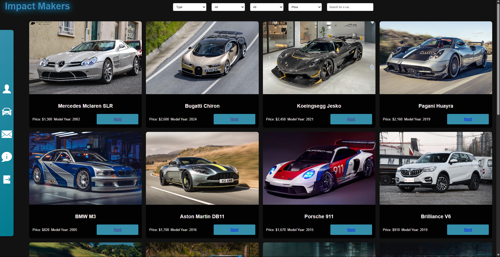
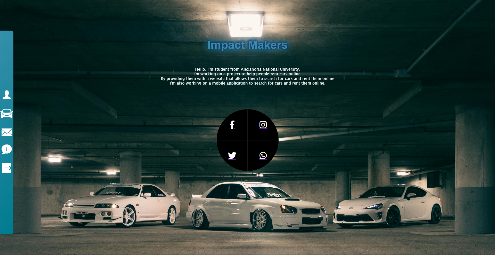

## 🚗 Car Rental Management System

<div align="center">
   
   # Welcome to the **Car Rental System** <br> A modern, full-featured web application for renting cars online, built with :        <p align="center">
  
</p>
</div>


---

## 🌟 Features

- **User Authentication:** Secure sign up and login with password hashing.
- **Profile Management:** Update your personal info and phone number.
- **Car Dashboard:** Browse, search, and filter available cars.
- **Car Details:** View detailed information for each car.
- **Online Reservation:** Reserve cars with a simple form and see real-time total cost calculation.
- **Payment Integration:** Enter payment details securely for each reservation.
- **Reservation History:** View your past and current reservations.
- **Responsive Sidebar Navigation:** Quick access to profile, dashboard, contacts, about, and logout.
- **Modern UI:** Clean, responsive design with animated backgrounds and intuitive layouts.

---

## 🖥️ Project Structure

```
car_rental_program/
│
├── admin/
│   │
│   ├── request/
│   │   │
│   │   ├── cars/
│   │   │   ├── edit.php
│   │   │   ├── index.php
│   │   │   └── overview.php
│   │   │
│   │   ├── customers/
│   │   │   ├── edit.php
│   │   │   ├── index.php
│   │   │   └── overview.php
│   │   │
│   │   └── reservations/
│   │       ├── add.php
│   │       ├── index.php
│   │       └── overview.php
│   │
│   ├── style_admin/
│   │   ├── choose-styl1.css
│   │   ├── LoginStyle.css
│   │   ├── request-style.css
│   │   └── style.css
│   │
│   ├── add.php
│   ├── check_cars.php
│   ├── check_tables.php
│   ├── header.php
│   ├── index.php
│   ├── logout.php
│   └── sidebar.php
│
├── photos/
│
├── style/
│   ├── about_us.css
│   ├── dashboard.css
│   └── style.css
│
├── about_us.html
├── carrentalsystem.sql
├── change_password.php
├── contacts.php
├── Dashboard.php
├── db_connection.php
├── details.php
├── index.html
├── index.php
├── main.js
└── profile.php
```

---

## 🚀 Quick Start

1. **Clone the repository:**
   ```bash
   git clone https://github.com/youssef324/car_rental_program.git
   ```

2. **Setup Database:**
   - Import the provided SQL schema into your MySQL server.
   - Update database credentials in PHP files if needed.

3. **Run Locally:**
   - Place the project folder in your XAMPP `htdocs` directory.
   - Start Apache and MySQL from XAMPP Control Panel.
   - Visit [http://localhost/car_rental_program/index.php](http://localhost/car_rental_program/index.php) in your browser.

---

## 📝 Usage

- **Sign Up:** Create a new account with your details.
- **Login:** Access your dashboard and profile.
- **Browse Cars:** View all available cars and their details.
- **Reserve:** Select dates, enter payment info, and confirm your reservation.
- **Profile:** Update your name, email, and phone number anytime.
- **Contact:** Reach out to the team via the contact page.

---

## 👨‍💻 Technologies Used

- **Frontend:** HTML5, CSS3, JavaScript (Vanilla)
- **Backend:** PHP (OOP & MySQLi)
- **Database:** MySQL
- **UI:** Responsive design, Font Awesome icons, custom CSS

---

## 🤝 Contributors

- [youssef324](https://github.com/youssef324) and the Impact Makers team

---

## 📷 Screenshots




---

## 📬 Contact

For questions, suggestions, or contributions, open an issue or contact [youssef324](https://github.com/youssef324) on GitHub.

---

**Enjoy renting with us! 🚙**
